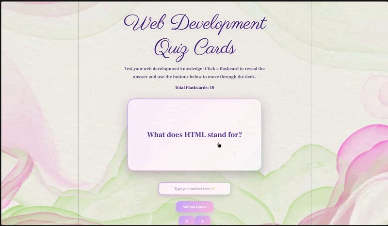

# Web Development Project 3 - Web Development Quiz Cards

Submitted by: **Hina Sadiq**

This web app: **An interactive flashcard application that helps users study basic web development concepts. Users can flip cards to reveal answers, enter guesses, receive feedback on their responses, and navigate through a deck of flashcards using previous and next controls.**

Time spent: **5 hours** spent in total

## Required Features

The following **required** functionality is completed:

  [x] **The user can enter their guess into an input box before seeing the flipside of the card**
  [x] Application features a clearly labeled input box with a submit button where users can type in a guess
  [x] Clicking on the submit button with an incorrect answer shows visual feedback that it is wrong
  [x] Clicking on the submit button with a correct answer shows visual feedback that it is correct

  [x] **The user can navigate through an ordered list of cards**
  [x] A forward/next button displayed on the card navigates to the next card in a set sequence when clicked
  [x] A previous/back button displayed on the card returns to the previous card in a set sequence when clicked
  [x] Both the next and back buttons have a visual indication when the user is at the beginning or end of the list

## Optional Features

The following **optional** features are implemented:

  [x] A user’s answer may be counted as correct even when it is slightly different from the target answer
  [x] Answers ignore uppercase/lowercase discrepancies

## Additional Features

The following **additional** features are implemented:

  [x] Animated flashcard flip effect
  [x] Custom pastel purple and sage green design
  [x] Glassmorphism flashcard styling
  [x] Gradient flashcard borders
  [x] Responsive design for smaller screens
  [x] Custom typography using Parisienne and Frank Ruhl Libre fonts
  [x] Background image and themed UI
  [x] Arrow-based navigation controls

## Video Walkthrough

Here's a walkthrough of implemented user stories:

GIF created with Kap.

## Notes

One challenge was implementing the flashcard flip animation while maintaining the custom design and responsiveness. Another challenge was styling the flashcards, navigation controls, and input elements so that they matched the overall theme while remaining easy to use.

## License

    Copyright 2026 Hina Sadiq

    Licensed under the Apache License, Version 2.0 (the "License");