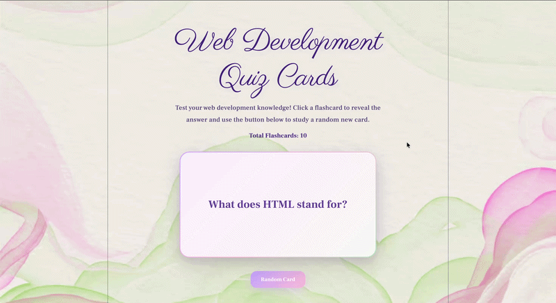

# Web Development Project 2 - Web Development Quiz Cards

Submitted by: **Hina Sadiq**

This web app: **An interactive flashcard application that helps users learn basic web development concepts. Users can click a flashcard to reveal the answer and use a button to display a random new flashcard.**

Time spent: **4 hours** spent in total

## Required Features

The following **required** functionality is completed:

 [x] **The app displays the title of the card set, a short description, and the total number of cards**

   [x] Title of card set is displayed
   [x] A short description of the card set is displayed
   [x] A list of card pairs is created
   [x] The total number of cards in the set is displayed
   [x] Card set is represented as a list of card pairs (an array of dictionaries where each dictionary contains the question and answer is perfectly fine)

 [x] **A single card at a time is displayed**

   [x] Only one half of the information pair is displayed at a time

 [x] **Clicking on the card flips the card over, showing the corresponding component of the information pair**

   [x] Clicking on a card flips it over, showing the back with corresponding information
   [x] Clicking on a flipped card again flips it back, showing the front

 [x] **Clicking on the next button displays a random new card**

## Optional Features

The following **optional** features are implemented:

 [ ] Cards contain images in addition to or in place of text
 [ ] Cards have different visual styles such as color based on their category

## Additional Features

The following **additional** features are implemented:

 [x] Custom pink, lavender, and sage green theme
 [x] Animated flashcard flip effect
 [x] Glassmorphism card design with shadows
 [x] Responsive layout for smaller screens
 [x] Randomized flashcard selection without immediately repeating the current card

## Video Walkthrough

Here's a walkthrough of implemented required features:

GIF created with EZGIF

## Notes

One challenge I encountered was creating the card flip animation while maintaining a responsive layout. Another challenge was styling the application with a custom aesthetic theme and ensuring the flashcards remained readable against the background image.

## License

Copyright 2026 Hina Sadiq

Licensed under the Apache License, Version 2.0.
